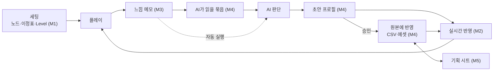

# 밸런스 루프 전체 계획 (PLAN)

- 갱신: 2026-10-10
- 지금: M1 구현·커밋 완료, Unity 손 확인 대기 → 다음은 M2
- 작업 브랜치: `feat/testSetup` (feat/analytics → feat/playtestTools → feat/testSetup 순서로 쌓임)

## 목표

정확한 상태에서 플레이하고, 느낌을 적고, AI가 그걸 읽어 수치를 고치면, 바로 같은 상태로 다시 플레이한다. 이 한 바퀴를 몇 분 안에 돈다.

1. **세팅**: 특정 노드 Rank와 이정표 단계, 블랙홀 Level을 정확히 정하고 그 상태로 바로 플레이한다.
2. **수치 연동**: 기획자가 정리한 수치(노드 CSV, 전투 기본값, 기획 시트)가 바뀌면 게임과 에디터가 바로 따라온다.
3. **메모**: 그 세팅 기준의 느낌을 에디터나 게임에서 적으면 그 순간의 세팅·수치·판 상태와 함께 JSON으로 바로 쌓인다.
4. **AI 조정**: AI가 메모와 수치를 읽고 의도에 맞게 수치를 바꾼다. 바뀐 값은 2번으로 바로 반영되고, 기록이 남고, 되돌릴 수 있다.

## 전제

- 노드 Rank와 이정표 단계만 정하면 적 정보, 플레이어 스탯, 스킬이 모두 정해진다.
  - 근거: `GameSessionFactory`가 노드 → `UpgradeStatValues` → Breaker·제한 시간·적 구성으로 판을 만들고, 성장도(이정표 단계)는 블랙홀의 시작·목표 Level과 전장 배율에만 쓴다.
  - 블랙홀 Level은 판 안의 진행이다. EXP를 채워 원래 길로 올리면 Level업 성장 공급과 성장 시간이 같이 따라온다.
- 게임은 시작할 때(`GameBootstrap.Awake`) 수치를 한 번 읽고, 판 구성은 판을 시작할 때 굳는다.
- 모든 도구는 에디터와 개발 빌드에만 들어간다. 출시 빌드에는 영향이 없다.

### 수치가 사는 곳

| 수치 | 파일 | 원본 | 지금 고치는 방법 |
| --- | --- | --- | --- |
| 노드: 수치 정의(기본값·Min·Max) | `Assets/Data/NodeTable/UpgradeStats.csv` | 구글 시트 v3 | 시트에서 고친 뒤 CSV로 내려받아 덮어쓰기 |
| 노드: 목록·Rank 수 | `Assets/Data/NodeTable/Nodes.csv` | 구글 시트 v3 | 〃 |
| 노드: Rank별 비용 | `Assets/Data/NodeTable/NodeCost.csv` | 구글 시트 v3 | 〃 |
| 노드: Rank별 효과 | `Assets/Data/NodeTable/NodeEffects.csv` | 구글 시트 v3 | 〃 |
| 노드: 칸·선·시작 노드 | `Assets/Data/NodeCatalog.asset` | 에셋 | Node Tree 창 |
| 판 규칙(제한 시간·처치 시간) | `Assets/Data/BattleRules.asset` | 에셋 | Inspector |
| Breaker 기본값 | `Assets/Data/SkillSetup.asset` | 에셋 | Inspector |
| 적 종류(속도·크기·등급별 HP·Gold·EXP·성질) | `Assets/Data/Enemies/*.asset` | 에셋 | Inspector |
| 출현 띠·시작 공급 | `Assets/Data/EnemySupplySetup.asset` | 에셋 | Inspector |
| Level 사다리·이정표 | `Assets/Data/HqGrowthSetup.asset` | 에셋 | Inspector |
| 테스트용 덧씌움 | `Assets/Playtest/Profiles/*.json` | 밸런스 프로필 | JSON(개발 전용) |

팀 결정(10월 초): 전투 기본값의 주인은 에셋이다. 노드 수치의 주인은 구글 시트이고, 레포의 CSV는 그 사본이다.

## 루프

## 마일스톤

| # | 이름 | 끝나면 되는 것 | 상태 | 브랜치 | 문서 |
| --- | --- | --- | --- | --- | --- |
| M0 | 공용 테스트 도구 | 프로필·시나리오·개발 패널·HUD·메모·contentVersion | 완료 (Unity 확인 일부 남음) | `feat/playtestTools` | [M0](M0-playtest-tools.md) |
| M1 | 테스트 세팅 창 | 노드·이정표·Level을 정확히 정해 바로 플레이, 확정 정보 보기 | 구현·커밋 완료, Unity 확인 대기 | `feat/testSetup` | [M1](M1-test-setup.md) |
| M2 | 수치 실시간 반영 | 수치 파일이 바뀌면 몇 초 안에 창과 플레이 중인 게임이 새 값으로 바뀐다 | 다음 | `feat/liveData` | [M2](M2-live-data.md) |
| M3 | 플레이 메모 | 세팅 기준 느낌을 적으면 세팅·수치·판 상태와 함께 JSON으로 바로 쌓인다 | 예정 | `feat/feelNotes` | [M3](M3-feel-notes.md) |
| M4 | AI 조정 | AI가 메모를 읽고 초안을 만들면 바로 비교 플레이하고, 승인하면 원본에 반영한다 | 예정 | `feat/aiTuning` | [M4](M4-ai-tuning.md) |
| M5 | 기획 시트 연동 | 구글 시트와 레포 CSV를 끌어오고 반영한다 | 결정 대기 | `feat/sheetSync` | [M5](M5-sheet-sync.md) |
| M6 | 자동 루프 (선택) | 메모를 저장하면 AI가 알아서 초안을 만든다 | 결정 대기 | 미정 | [M6](M6-auto-loop.md) |

순서의 이유:

- M2가 먼저다. M3의 메모와 M4의 AI 변경 모두 "지금 어떤 수치로 플레이했나(수치 지문)"와 "바꾸면 바로 반영"에 기댄다.
- M5는 원본 위치와 인증 방식을 정해야 해서 뒤에 둔다. 그 전까지는 레포 CSV가 작업본이고 시트 반영은 사람이 한다.

## 진행 규칙

1. 한 번에 마일스톤 하나만 진행한다. 시작할 때 그 문서의 작업 목록과 완료 기준을 확정한다.
2. 마일스톤이 끝날 때마다 다음 순서로 마무리한다.
   1. 마일스톤 문서에 결과·검증·남은 일을 적는다.
   2. 이 PLAN의 표·결정·위험·열린 질문을 다시 점검하고, 다음 마일스톤 문서를 지금 상황에 맞게 고친다.
   3. 커밋한다.
3. 브랜치: 마일스톤마다 앞 마일스톤 브랜치에서 따낸다. PR도 그 순서대로 올린다.
4. 커밋: Claude가 직접 한다. 작성자 HillRiver, `type: 설명`(CONTRIBUTING), 트레일러 없음. push는 요청할 때만 한다.
5. 검증은 세 겹이다.
   - 개발·릴리스·에디터 세 설정 컴파일
   - 실제 데이터 헤드리스 테스트
   - Unity 손 확인(사용자). 손 확인 결과는 마일스톤 문서에 따로 적는다.
6. 결정이 필요한 것은 그 마일스톤을 시작할 때 묻는다. 묻기 전까지는 문서의 권장안을 기본으로 둔다.

## 결정 기록

| 날짜 | 결정 | 근거 |
| --- | --- | --- |
| 10-09 | 밸런스 프로필 = 원본 위에 덧씌우는 JSON. 판의 contentVersion에 이름을 남기고, 조작한 판은 `+test` | 원본을 지키며 A/B 비교 |
| 10-09 | 프로필을 쓰는 동안 진행 저장은 프로필마다 따로, 시나리오를 쓴 실행은 저장 안 함 | 테스트 값이 실제 저장을 덮지 않게 |
| 10-10 | 테스트 세팅은 노드 Rank·이정표 단계·블랙홀 Level만 정한다. 나머지는 게임과 같은 길로 계산해 보여 준다 | 전제(노드+이정표 = 전부 확정) |
| 10-10 | 세팅과 시나리오는 한 형식(시나리오 JSON) | 에디터 창과 개발 패널이 같은 파일을 쓴다 |
| 10-10 | 계획은 `Docs/BalanceLoop/`에 두고 마일스톤마다 갱신한다 | 사용자 요청 |

## 열린 질문

| # | 질문 | 권장안 | 정할 때 |
| --- | --- | --- | --- |
| Q1 | 플레이 중 수치가 바뀌면 어떻게 할까 | 지금 세팅·같은 시드로 장면을 다시 시작 | M2 시작 |
| Q2 | 메모를 어디에 둘까 | 레포 `PlaytestData/`(git 무시). 팀 공유가 필요하면 그때 커밋 대상으로 | M3 시작 |
| Q3 | AI가 수치를 어떻게 바꿀까 | 먼저 초안 프로필(덧씌움)로 비교 플레이 → 승인하면 CSV·에셋에 반영(승격) | M4 시작 |
| Q4 | 기획 시트 연동 방식과 쓰기 허용 | 읽기는 웹 게시 CSV, 쓰기는 Apps Script 웹 앱이나 구글 커넥터 중 선택 | M5 시작 |
| Q5 | AI를 누가 언제 돌릴까 | 기본은 채팅에서 요청. 자동은 M6에서 결정 | M6 시작 |
| Q6 | 전투 요약 contentVersion에 수치 지문을 넣을까 | M2에서 지문을 만들고, 서버 계약(64자) 안에서 `프로필@지문` 형식을 검토 | M2 끝 |

## 위험

| 위험 | 영향 | 대응 |
| --- | --- | --- |
| Unity는 기본 설정에서 플레이 중 에셋을 다시 가져오지 않는다 | 플레이 중 CSV를 고쳐도 반영이 안 된다 | M2에서 파일 감시 + 직접 가져오기(ImportAsset) |
| 레포 CSV와 구글 시트가 갈라진다 | 시트에서 다시 내려받으면 AI 변경이 사라진다 | M4 변경 기록에 "시트 미반영" 표시, M5에서 끌어오기 전에 경고 |
| AI가 한 번에 많이·크게 바꾼다 | 원인을 알 수 없게 된다 | M4 지침: 한 번에 값 3개 이하, 2배 이하, 이유와 메모 ID 필수, 되돌리기 |
| 게임 순서로는 만들 수 없는 세팅으로 느낌을 판단한다 | 실제 플레이와 다른 결론 | M1이 경고로 알린다. 메모에 그 여부를 같이 남긴다(M3) |
| 에디터 도구가 Unity 버전 API에 기댄다 | 다른 버전에서 컴파일 오류 | 클라우드 컴파일 + Unity 손 확인을 완료 기준에 넣는다 |

## 문서

- [M0 공용 테스트 도구](M0-playtest-tools.md)
- [M1 테스트 세팅 창](M1-test-setup.md)
- [M2 수치 실시간 반영](M2-live-data.md)
- [M3 플레이 메모](M3-feel-notes.md)
- [M4 AI 조정](M4-ai-tuning.md)
- [M5 기획 시트 연동](M5-sheet-sync.md)
- [M6 자동 루프](M6-auto-loop.md)
